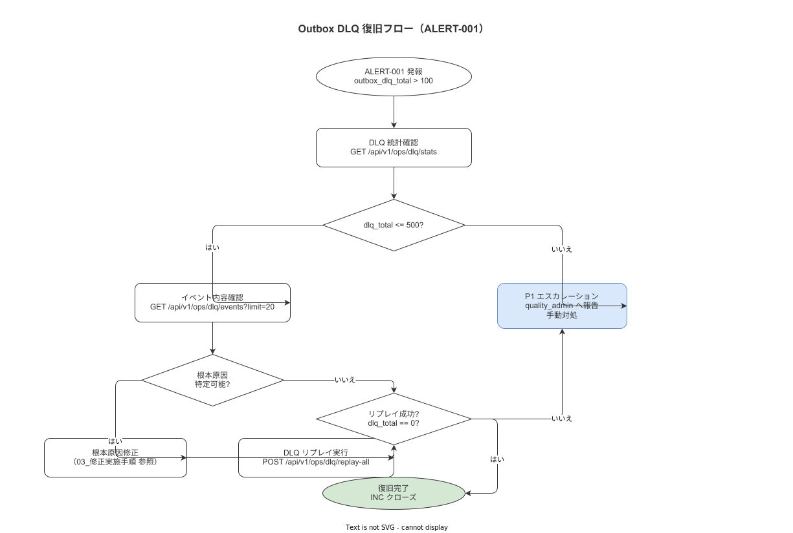

# 09 Outbox DLQ復旧手順

最終更新: 2026-05-18（Unit-14: 2バイナリ分割対応） | 管理者: system_admin | 根拠要件: ALERT-001

---

## 1 概要

**図 1: Outbox DLQ 復旧フロー**



> 原本: [`img/fig_outbox_dlq_recovery.drawio`](img/fig_outbox_dlq_recovery.drawio)

本章は ALERT-001（`outbox_dlq_total > 100`）が発報した際の DLQ（Dead Letter Queue）復旧手順を定義する。Outbox パターンにおける DLQ は「再試行に失敗したイベント」が蓄積する領域であり、放置すると作業記録の非同期処理に永続的な影響を与える。

**バイナリ役割分担**

| 役割 | バイナリ | 備考 |
|---|---|---|
| OutboxWorker（Outbox 処理実体） | **terminal-api**（8080）| 現場端末から受信した作業ログを非同期処理する tokio task |
| DLQ 管理 API（手動再投入エンドポイント） | **master-api**（8081）| 管理コンソール向け `/api/v1/ops/outbox/dlq` を提供 |

Outbox 処理に問題が発生した場合は、まず terminal-api のログおよびヘルスチェックを確認する。DLQ の手動操作は master-api 経由で実施するが、実際に再送を処理するのは terminal-api 内の OutboxWorker である。

**発動トリガー**

| トリガー | 条件 |
|---|---|
| ALERT-001 | `outbox_dlq_total > 100`（CRITICAL） |
| 手動確認 | DLQ 統計 API で pending > 0 を確認した場合 |

---

## 2 DLQ 内容確認

### 2.1 API による確認

DLQ 統計 API は管理コンソール向けの **master-api（8081）** が提供する。

```bash
# DLQ 統計サマリー（管理 API: master-api）
curl -fsS http://localhost:8081/api/v1/ops/outbox/dlq/stats \
  -H "Authorization: Bearer ${SYSTEM_ADMIN_JWT}" | jq .
# 期待レスポンス例:
# {
#   "dlq_total": 145,
#   "oldest_event": "2026-05-18T12:30:00+09:00",
#   "event_type_breakdown": {
#     "step_result_created": 100,
#     "inspection_result_created": 45
#   }
# }

# OutboxWorker（terminal-api）の稼働確認
curl -fsS http://localhost:8080/health | jq .
docker compose logs terminal-api --since 5m | grep -E "outbox|Outbox|Worker"
```

### 2.2 DB による確認

```sql
-- DLQ 件数・エラー内容確認
SELECT
  id,
  event_type,
  error_message,
  retry_count,
  created_at,
  last_failed_at
FROM outbox_dlq
ORDER BY created_at ASC
LIMIT 20;

-- エラーメッセージ別集計
SELECT
  error_message,
  count(*) AS event_count,
  min(created_at) AS oldest,
  max(last_failed_at) AS latest_failure
FROM outbox_dlq
GROUP BY error_message
ORDER BY event_count DESC;

-- イベントタイプ別集計
SELECT
  event_type,
  count(*) AS total,
  avg(retry_count) AS avg_retries
FROM outbox_dlq
GROUP BY event_type;
```

**本節で確定した方針**
- **DLQ 確認は必ず API + DB の両方で実施し、件数の一致を確認する。**
- **最古のイベント（oldest_event）から根本原因の発生時刻を推定する。**
- **確認結果を INC 記録に添付する（スクリーンショットまたはクエリ出力のテキスト）。**

---

## 3 根本原因の分類

DLQ の内容確認後、以下の 3 パターンで根本原因を分類する。

| 分類 | 判定基準 | 対処 |
|---|---|---|
| 一時障害 | error_message が「connection refused」「timeout」系 | Outbox Worker 再起動後に再送 |
| 永続障害 | retry_count が最大値に達している・同じエラーが繰り返す | 原因を修正後に再送 |
| アプリバグ | error_message がアプリケーションエラー（パニック・バリデーション）| コード修正後に再送または廃棄判断 |

**一時障害の例**

```sql
-- 一時障害パターン
SELECT * FROM outbox_dlq WHERE error_message LIKE '%connection%' OR error_message LIKE '%timeout%';
```

**永続障害の例**

```sql
-- 永続障害パターン（最大リトライ到達）
SELECT * FROM outbox_dlq WHERE retry_count >= 10;
```

**本節で確定した方針**
- **分類は DB の error_message で行い、推測で分類することを禁止する。**
- **「永続障害」と判定した場合は再送前に根本原因（RUN-010〜019）を解消させる。**
- **「アプリバグ」と判定した場合は廃棄前に quality_admin に報告し、データロスの範囲を確認する。**

---

## 4 手動再送（RUN-026 詳細）

### 4.1 再送前の確認

```bash
# OutboxWorker（terminal-api）が稼働中であることを確認
# terminal-api が停止中の場合は再送を実施しても処理されない
curl -fsS http://localhost:8080/health | jq '.status'
docker compose logs terminal-api --since 5m | grep -E "outbox|Outbox|Worker"

# OutboxWorker の状態確認（管理 API: master-api 経由）
curl -fsS http://localhost:8081/api/v1/ops/outbox/worker/status \
  -H "Authorization: Bearer ${SYSTEM_ADMIN_JWT}" | jq '.status'
# 期待値: "running"

# OutboxWorker が停止中の場合は terminal-api を再起動
docker compose restart terminal-api
```

### 4.2 全件再送

```bash
# 全件再送（一時障害の場合）- DLQ 管理 API は master-api 経由
curl -fsX POST http://localhost:8081/api/v1/ops/outbox/dlq/replay \
  -H "Content-Type: application/json" \
  -H "Authorization: Bearer ${SYSTEM_ADMIN_JWT}" \
  -d '{"mode": "all"}' | jq .
```

### 4.3 イベントタイプ別再送

```bash
# 特定イベントタイプのみ再送 - DLQ 管理 API は master-api 経由
curl -fsX POST http://localhost:8081/api/v1/ops/outbox/dlq/replay \
  -H "Content-Type: application/json" \
  -H "Authorization: Bearer ${SYSTEM_ADMIN_JWT}" \
  -d '{"mode": "filter", "event_type": "step_result_created"}' | jq .
```

### 4.4 再送後の確認

```bash
# DLQ 件数の変化を確認（30 秒ごとにポーリング）
watch -n 30 'curl -fsS http://localhost:8081/api/v1/ops/outbox/dlq/stats \
  -H "Authorization: Bearer ${SYSTEM_ADMIN_JWT}" | jq .dlq_total'
```

**本節で確定した方針**
- **再送は system_admin の JWT 認証が必須。認証なしの再送は禁止する。**
- **DLQ 管理 API（再送エンドポイント）は master-api（8081）が提供するが、実際の処理は terminal-api 内の OutboxWorker が行う。再送前に terminal-api が稼働中であることを必ず確認する。**
- **全件再送は永続障害・アプリバグの解消確認後にのみ実施する。解消前の再送は DLQ を増加させる。**
- **再送後 5 分以内に DLQ 件数が減少しない場合は再送を停止し、原因を再分類する。**

---

## 5 廃棄判断（削除）

廃棄対象: 補正不可能な壊れたイベント（ペイロードが破損・参照先レコードが存在しない等）

```bash
# 廃棄対象の特定（DLQ 管理 API: master-api 経由）
curl -fsS "http://localhost:8081/api/v1/ops/outbox/dlq/candidates?type=discard" \
  -H "Authorization: Bearer ${SYSTEM_ADMIN_JWT}" | jq .
```

廃棄には quality_admin の承認が必要。承認なしの廃棄は禁止する。

```bash
# 廃棄実行（quality_admin 承認後）- DLQ 管理 API は master-api 経由
curl -fsX DELETE "http://localhost:8081/api/v1/ops/outbox/dlq/{DLQ_ID}" \
  -H "Content-Type: application/json" \
  -H "Authorization: Bearer ${SYSTEM_ADMIN_JWT}" \
  -d '{"reason": "補正不可能な破損イベント。承認者: quality_admin。INC-YYYY-NNN"}' | jq .
```

廃棄実施後は廃棄したイベントの内容・件数・理由を INC 記録に記録する。

**本節で確定した方針**
- **廃棄（削除）は quality_admin の口頭承認 + INC 記録への記録を必須とする。**
- **廃棄したイベントの内容は削除前にテキストとして INC 記録に保存する（ALCOA+ Enduring）。**
- **廃棄件数が 10 件を超える場合はポストモーテム（11 章）を実施する。**

---

## 6 DLQ 後処理（完了確認）

```bash
# 再送・廃棄後の最終確認（DLQ 管理 API: master-api 経由）
curl -fsS http://localhost:8081/api/v1/ops/outbox/dlq/stats \
  -H "Authorization: Bearer ${SYSTEM_ADMIN_JWT}" | jq .dlq_total
# 期待値: 0（または廃棄判断済みの件数のみ残存）

# terminal-api（OutboxWorker）が正常稼働中であることを確認
curl -fsS http://localhost:8080/health | jq .
docker compose logs terminal-api --since 10m | grep -E "outbox|Outbox|Worker" | tail -20

# Prometheus ALERT-001 の解消確認
curl -fsS "http://localhost:9090/api/v1/query?query=outbox_dlq_total" \
  | jq '.data.result[].value[1]'
# 期待値: < 100（ALERT-001 閾値未満）
```

```sql
-- DB での最終確認
SELECT count(*) AS remaining_dlq FROM outbox_dlq;
-- 期待値: 0

-- Outbox pending 件数確認
SELECT status, count(*) FROM outbox_events GROUP BY status;
-- pending = 0 が理想（または急速に減少中）
```

**本節で確定した方針**
- **DLQ = 0 かつ ALERT-001 が解消されたことを Grafana で確認した後に F4 復旧完了を宣言する。**
- **復旧後に Outbox Worker の再起動サイクルを 24 時間監視し、再発しないことを確認する。**
- **廃棄件数が 0 でない場合はポストモーテムでデータロスの影響範囲を分析する。**

---

## 参照業界分析

### 必須
- Microsoft Outbox パターン（Azure Architecture Patterns）— Outbox/DLQ 設計の参考
- IPA「システム管理基準」4.2.1.c — 非同期処理障害の管理手順根拠

### 関連
- Apache Kafka Dead Letter Queue — DLQ 分類・再送・廃棄判断の設計参考
- 21 CFR Part 11（FDA 電子記録）— DLQ 廃棄時のデータロス報告要件の根拠
