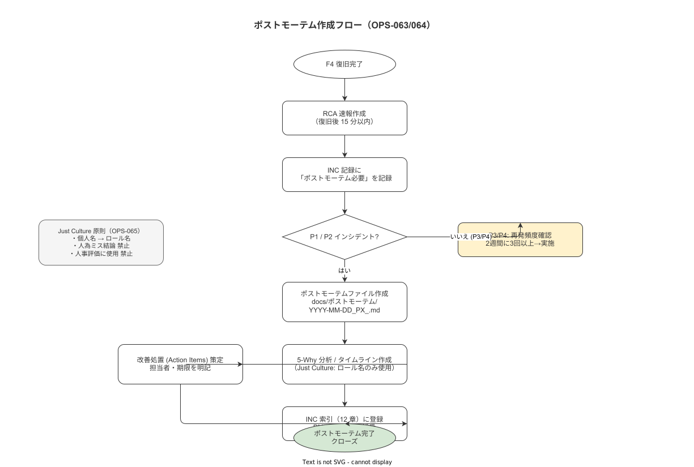

# 11 ポストモーテム手順とテンプレート

最終更新: 2026-05-18 | 管理者: system_admin | 根拠要件: OPS-063 / OPS-064 / OPS-065 / OPS-066

---

## 1 Just Culture 適用宣言

本章および `docs/ポストモーテム/` 配下の全ファイルに Just Culture 原則（OPS-065）を適用する。

- 個人への非難・攻撃的表現の使用を禁止する
- タイムラインには個人名ではなくロール名（例: system_admin）のみ使用する
- ポストモーテムの内容を人事評価に使用することを禁止する（OPS-066）
- 「人為ミス」という原因結論は禁止する。人がミスした場合は「そのミスを誘発したシステム・プロセス」を根本原因とする

**本節で確定した方針**
- Just Culture 原則（OPS-065）を全ポストモーテムに適用することを確定する。
- 個人名の使用禁止・ロール名への置換を確定する。
- ポストモーテム内容の人事評価への利用を禁止することを確定する。

---

## 2 実施義務（OPS-063）

**図 1: ポストモーテム作成フロー**



> 原本: [`img/fig_postmortem_flow.drawio`](img/fig_postmortem_flow.drawio)

| 優先度 | 義務 |
|---|---|
| P1 | 必須（例外なし） |
| P2 | system_admin が要否を判断し原則実施する |
| P3/P4 | 不要（ただし P3 が 2 週間に 3 回以上再発する場合は実施する）|

**本節で確定した方針**
- P1 ポストモーテムは例外なく必須とすることを確定する。
- P2 ポストモーテムは system_admin が要否を判断し原則実施することを確定する。
- P3/P4 は 2 週間に 3 回以上再発した場合にポストモーテムを実施することを確定する。

---

## 3 実施手順フロー（OPS-063/064）

```
F4（復旧完了）
    ↓
RCA 速報を作成（復旧後 15 分以内）
    ↓
INC 記録に「ポストモーテム必要」を記録
    ↓
ファイル名を決定: docs/ポストモーテム/YYYY-MM-DD_PX_<slug>.md
    ↓
テンプレートでファイルを作成
    ↓
各セクションを記入（タイムライン・5 Whys・アクション項目）
    ↓
quality_admin レビュー（任意だが P1 は推奨）
    ↓
アクション項目を課題管理に登録
    ↓
PM-YYYY-NNN を 12 章 INC 台帳に登録
    ↓
SLO 期限内に完了（P1: 48h / P2: 72h）
```

**本節で確定した方針**
- 復旧完了後 15 分以内に RCA 速報を作成することを確定する。
- ファイル名規約（`YYYY-MM-DD_PX_<slug>.md`）に従いファイルを作成することを確定する。
- アクション項目を課題管理（GitHub Issues）に登録することを確定する。

---

## 4 物理配置規約（OPS-064）

| 項目 | 規約 |
|---|---|
| 配置先 | `docs/ポストモーテム/YYYY-MM-DD_PX_<slug>.md` |
| YYYY-MM-DD | インシデント発生日（JST） |
| PX | P1 または P2 |
| slug | 内容を表す英語ケバブケース（最大 5 単語） |
| 例 | `docs/ポストモーテム/2026-05-20_P1_api-db-connection-timeout.md` |

本章はテンプレートのみを提供する。個別ポストモーテムのファイルは `docs/ポストモーテム/` に格納する。

**本節で確定した方針**
- 配置先は `docs/ポストモーテム/YYYY-MM-DD_PX_<slug>.md` とすることを確定する。
- YYYY-MM-DD はインシデント発生日（JST）とすることを確定する。
- slug は英語ケバブケース・最大 5 単語とすることを確定する。

---

## 5 ポストモーテムテンプレート

以下のテンプレートをコピーして `docs/ポストモーテム/YYYY-MM-DD_PX_<slug>.md` を作成する。

```markdown
# PM-YYYY-NNN ポストモーテム: {タイトル}

INC 番号: INC-YYYY-NNN
PM 番号: PM-YYYY-NNN
発生日時（JST）: YYYY-MM-DD HH:MM
復旧日時（JST）: YYYY-MM-DD HH:MM
優先度: P1 / P2
作成者ロール: system_admin
作成日: YYYY-MM-DD
最終更新: YYYY-MM-DD

---

## 1 概要

（3〜5 文で記述。個人名を含めない。システム・プロセスの視点で記述する。）

例: YYYY-MM-DD HH:MM 頃から API が 503 を返し始め、作業記録の書き込みが{N}分間不能となった。
原因は PostgreSQL の接続枯渇であり、Outbox Worker と API の接続プール設定のミスマッチが
常時稼働中に接続を消費し続けた結果として発生した。RUN-021 の実施により HH:MM に復旧した。

## 2 影響

| 項目 | 内容 |
|---|---|
| 影響開始時刻（JST） | YYYY-MM-DD HH:MM |
| 影響終了時刻（JST） | YYYY-MM-DD HH:MM |
| ダウンタイム | {N} 分 |
| 影響工程 | {工程名 / 全工程} |
| 影響ユーザー数（概数） | {N} 名 |
| 作業記録への影響 | 完全停止 / 一部影響 / データロス有無 |
| ALCOA+ への影響 | あり（内容: ...）/ なし |
| 規制報告要否 | 要（quality_admin 判断済み）/ 不要 |

## 3 タイムライン（JST）

（ロール名のみ。個人名禁止。5 分単位）

| 時刻（JST） | 出来事 | 担当ロール |
|---|---|---|
| HH:MM | Grafana が ALERT-NNN を発報 | — |
| HH:MM | system_admin が検知・INC-YYYY-NNN を仮登録 | system_admin |
| HH:MM | 通知文書を発行（F2 完了） | system_admin |
| HH:MM | RUN-0NN で原因を特定（F3 完了） | system_admin |
| HH:MM | RUN-0NN で復旧作業開始（F4 開始） | system_admin |
| HH:MM | health check 200 OK 確認（F4 完了）| system_admin |

## 4 SLO 目標 vs 実測

| フェーズ | P{N} SLO 目標 | 実測 | 差分 | 超過原因 |
|---|---|---|---|---|
| F1 検知 | {N} 分以内 | {N} 分 | +{N} 分 / なし | ... |
| F2 通知 | {N} 分以内 | {N} 分 | +{N} 分 / なし | ... |
| F3 切り分け | {N} 分以内 | {N} 分 | +{N} 分 / なし | ... |
| F4 復旧（RTO） | {N} 時間以内 | {N} 分 | +{N} 分 / なし | ... |

## 5 根本原因（5 Whys）

Why 1: なぜ作業記録の書き込みが失敗したか？
→ API が 503 を返していたから

Why 2: なぜ API が 503 を返したか？
→ PostgreSQL への接続が確立できなかったから

Why 3: なぜ PostgreSQL への接続が確立できなかったか？
→ max_connections に達していたから

Why 4: なぜ max_connections に達したか？
→ Outbox Worker の接続プール設定が大きすぎたから

Why 5: なぜ Outbox Worker の設定が大きすぎたか？
→ デプロイ時に API と Outbox Worker の合計接続数を検証する手順がなかったから

**根本原因（確定）**:
{システム・プロセスの問題として記述。個人の能力・不注意を根本原因としない}

## 6 何がうまく行ったか（肯定的観察）

- Grafana の ALERT-001 がXX分で発報し、手動確認より早く検知できた
- RUN-NNN の手順が明確で、初めて対応した際も迷わずに実施できた
- ...

## 7 何がうまく行かなかったか（システム視点）

- 接続プール設定の検証手順がデプロイフローに含まれていなかった
- ALERT-NNN の誤検知率が高く、対応優先度の判断に時間がかかった
- ...

## 8 アクション項目（SMART 原則）

| # | アクション | 種別 | 担当ロール | 期限 | 完了確認方法 |
|---|---|---|---|---|---|
| 1 | Outbox Worker と API の接続プール設定をデプロイチェックリストに追加する | 予防 | system_admin | YYYY-MM-DD | チェックリスト更新の確認 |
| 2 | max_connections 使用率 > 80% のアラートを追加する | 検知改善 | system_admin | YYYY-MM-DD | Prometheus ルールの追加確認 |
| 3 | ... | ... | ... | ... | ... |

（SMART: Specific / Measurable / Achievable / Relevant / Time-bound）

## 9 規制影響評価

| 項目 | 評価 |
|---|---|
| 21 CFR Part 11 への影響 | あり（内容: ...）/ なし |
| ALCOA+ への影響 | あり（違反内容: ...）/ なし |
| 外部規制機関への報告 | 要（内容・期限: ...）/ 不要 |
| 判断者（ロール） | quality_admin |

---

## 参照

- INC 記録: 12 章（INC-YYYY-NNN）
- 使用した RUN: RUN-NNN, RUN-NNN
- 関連 ADR: ADR-NNN（あれば）
```

**本節で確定した方針**
- 上記テンプレートをそのままコピーしてポストモーテムファイルを作成することを確定する。
- テンプレートの全セクションを記入しスキップを禁止することを確定する。
- §9 規制影響評価は quality_admin が判断者として記入することを確定する。

---

## 6 Just Culture 表現規約

| 禁止表現 | 代替表現 |
|---|---|
| 「{名前}がミスをした」 | 「誤操作が発生した」（受動態）|
| 「{名前}の確認不足」 | 「確認ステップが手順に含まれていなかった」|
| 「{名前}が対応が遅れた」 | 「対応に XX 分を要した」|
| 「考慮不足」「不注意」 | 「チェック機構が存在しなかった」|
| 「ヒューマンエラー」（最終原因として）| 「エラーを誘発したシステム設計・手順の欠如」|

**本節で確定した方針**
- 表中の禁止表現の使用を全ポストモーテムで禁止することを確定する。
- レビュー時に禁止表現が含まれていた場合は修正してから登録することを確定する。
- Just Culture 表現規約はポストモーテム記入者全員が事前に確認することを確定する。

---

## 参照業界分析

### 必須
- Google SRE Book Chapter 15 "Postmortem Culture: Learning from Failure" — Just Culture 適用と 5 Whys の参考
- IPA「システム管理基準」4.2.2.b — ポストモーテム（問題管理）の要件根拠

### 関連
- Sidney Dekker "The Field Guide to Understanding Human Error" — Just Culture の理論的背景
- 21 CFR Part 11 / ALCOA+ — §9 規制影響評価の根拠
